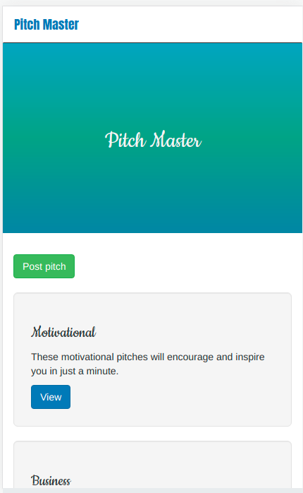

# Pitch Master
#### Created in sep 23, 2021
#### By **Grievin Otieno**
## Description
Pitch Master is an application that allows a user to view, login and create a pitch, like and comment on various pitches that are created by other users too.

## Setup/Installation Requirements
* Git
* Python 3.8
* Github
* Flask version 1.1.2
* Pip
* Chrome or any other Browser of your choice

## Setup Installation
* Fork this repository
* Copy the code and clone it to your Command line
* cd to that directory
* activate the virtual environment by:

python3.8 -m venv virtual

source virtual/bin/activate

pip install -r requirements.txt

pip install -r requirements.txt

chmod a+x start.sh 

./start.sh

* Navigate to your browser on http://127.0.0.1:5000/ to view the app

## Known Bugs
None at the moment.
## Technologies used
* Flask
* Python
* Postgres SQL
* HTML
* CSS

## Preview of the app
* This is how the app looks like in your machine

* Comment on a pitch posted

* To post a pitch

* Phone responsiveness

* 

## Support and contact detail
You can always contribute  To the code or you can contact me @ +254714880548 or email me @ enogroti@gmail.com
### License
MIT
Copyright (c) 2021 **Grievin Otieno**
